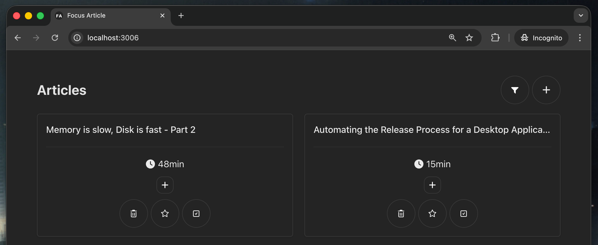

# Focus Article

Front-end implementation of Focus Article: A minimal self-storage project to save your favorite articles without any distraction.

<p align="center">
  
</p>

## Prerequisites

- [Focus Article Server](https://github.com/mathiasgheno/focus-article-server)
- [(optional) Focus Article Chrome Extension](https://github.com/mathiasgheno/focus-article-chrome-extension)

## How to Run

1. First, install all dependencies

```bash
bun install
```

2. Run the server

```bash
bun run watch
```

## Startup with your O.S

1. Install pm2 globally

```bash
npm i pm2 -g
```

2. Run pm2 script

```
bun run pm2
```

This is going to run focus-article-ui on port 3006. You need to do the same with focus-article-server. 

> Attention: If you already run this command before, you should run `pm2 kill` before.  